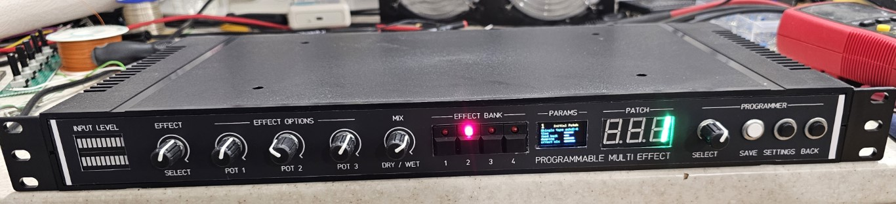

# Spin-FV-1-based-programmable-multi-effect

Based on the FV-1 datasheet, Hagiwo design and various versions of the FV-1 effects found on the internet, this is my own take on a programmable multi effects unit.

The programmer is based around a Teensy 2++, I understand these are hard to find now, but a Teensy 4.1 or similar can be used in its place, just note that if you do use a 3.3v compatible board then you can probably remove the level converters and just bypass them. Also if your board has an onboard SD card slot then again you can use that instead of the external one I have used. For the DAC I used the DAC8568-A variant, it produces 0-2.5v output and I have level converters for the 3.3v requirements. If you use a DAC8568-D variation it will output 0-5V and you can basically swap out the level converters for voltage followers same as the dry/wet mix CV's. But you will also gave to scale the DAC voltages again to producs 0-3.3v and 0-2v as required. The A variant can be obtained for around $5, whereas the D version can be around $25. Basically I was just using up old Arduino parts I had laying around. Patches are limited to 128 with a Teensy 2++, it simply will not boot any higher.

# Functions

* 32 effects cores based on the 8 internal effects of the chip and 24 external effects on 3 eeprom chips.
* Each effect has upto 3 variations and a wet/dry mix.
* All parameters are stored for each effect.
* Parameters can be sent over MIDI or disabled.
* 128 patches can be stored on the SD card.
* MIDI in to recall patches and also edit effects in realtime with CC numbers.
* MIDI out for parameter sending and future sysex dumps
* MIDI thru.
* Mono/Stereo inputs and outputs.

# Todo

* Foot switch bypass input
* Sysex dumps and loading of patches
